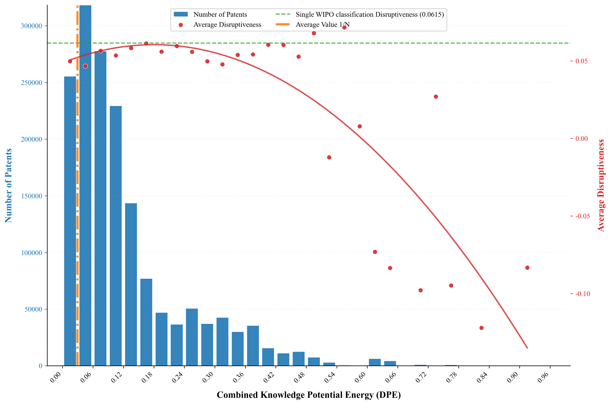

# Are Distant Knowledge Combinations Always More Disruptive in Patents?
## Overview
**Dataset and source code for paper *Are Distant Knowledge Combinations Always More Disruptive in Patents?***

This study revisits the linkage between knowledge recombination and patent disruptiveness from the perspective of knowledge potential energy. Our work includes the following aspects:
- We construct the **knowledge potential energy indicator** by integrating the intensity and directionality of knowledge flow, which improves the traditional knowledge distance measurement limited to combination frequency.
- We calculate the 5-year D-index to quantify patent disruptiveness based on patent citation networks.
- We empirically examine the nonlinear and asymmetric relationship between knowledge potential energy and patent disruptiveness using regression models and asymmetry tests.
- We explore the boundary conditions of knowledge recombination for fostering disruptive patents.

## Main findings
- Using millions of authorized USPTO utility patents (1980–2024), this study identifies an **inverted U-shaped relationship** between knowledge potential energy and patent disruptiveness.
 

    
    

    
<b>Figure 1. Patent quantity distribution and disruptive distribution under different potential energies</b>

  
- Moderate cross-domain knowledge combinations generate the highest disruptive innovation, while **overly homogeneous or overly distant knowledge recombination** both suppress patent disruptiveness.
- Knowledge recombination presents significant **asymmetry**: switching roles between core knowledge base and supplementary knowledge leads to distinct differences in patent disruptiveness.
- The knowledge potential energy framework effectively reconciles the conflicting views on knowledge distance and disruptive innovation in existing literature.

## Dataset Description
- Data source: [U.S. Patent and Trademark Office (USPTO) PatentsView database](https://www.uspto.gov/ip-policy/economic-research/patentsview#data)
- Time span: 1980 – 2024
- Sample type: Authorized utility patents with multiple classification numbers

## Dependency packages
System environment is set up according to the following configuration:
- python 3.8+
- pandas 2.0.0+
- numpy 1.24.0+

## Citation
Please cite the following paper if you use this code and dataset in your work.
> Authors. Are Distant Knowledge Combinations Always More Disruptive in Patents? *[Journal Name]*. [[doi]](https://doi.org/xxxx) [[Dataset & Source Code]](https://github.com/[YourUsername]/[RepoName])
